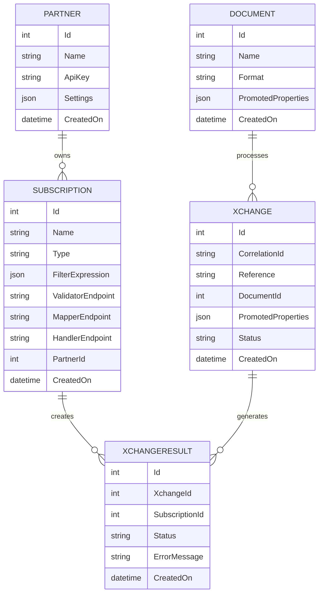

# Architecture Overview

Bitween is built on a modern, cloud-native architecture designed for scalability, reliability, and extensibility. This document provides a comprehensive overview of the system architecture and its components.

## High-Level Architecture

```
┌─────────────────┐    ┌─────────────────┐    ┌─────────────────┐
│   External      │    │    Bitween      │    │   Target        │
│   Systems       │───▶│   Middleware    │───▶│   Systems       │
│                 │    │                 │    │                 │
└─────────────────┘    └─────────────────┘    └─────────────────┘
                              │
                              ▼
                      ┌─────────────────┐
                      │   Serverless    │
                      │   Adapters      │
                      └─────────────────┘
```

## Core Components

### 1. Web API Layer (`SW.Bitween.Web`)

The main entry point for the system, providing:

- **RESTful APIs** for message ingestion and management
- **JWT Authentication** for secure access
- **Swagger Documentation** for API exploration
- **Health Checks** for monitoring

**Key Features:**
- ASP.NET Core 8.0 based
- OpenAPI/Swagger documentation
- Rate limiting and throttling
- CORS support for web clients

### 2. Business Logic Layer (`SW.Bitween.Api`)

Contains the core domain logic and services:

- **Domain Models** (Xchange, Subscription, Document, Partner)
- **Business Services** (XchangeService, FilterService, etc.)
- **Event Handlers** for asynchronous processing
- **Specifications** for complex queries

**Key Patterns:**
- Domain-Driven Design (DDD)
- CQRS with MediatR
- Repository Pattern
- Specification Pattern

### 3. Data Access Layer

Multi-database support through separate projects:

- **`SW.Bitween.PgSql`** - PostgreSQL support
- **`SW.Bitween.MySql`** - MySQL support  
- **`SW.Bitween.MsSql`** - SQL Server support

**Features:**
- Entity Framework Core
- Database migrations
- Connection pooling
- Query optimization

### 4. SDK Layer (`SW.Bitween.Sdk`)

Client libraries and shared models:

- **Client SDK** for external integrations
- **Shared Models** for data contracts
- **JSON Converters** for serialization
- **Mock Implementations** for testing

### 5. Serverless Framework

Custom adapter execution environment:

- **Handler Interface** (`IInfolinkHandler`)
- **Validator Interface** (`IInfolinkValidator`)
- **Mapper Interface** (`IInfolinkMapper`)
- **Receiver Interface** (`IInfolinkReceiver`)

## Scheduling Architecture

Receiving and aggregation jobs run on a persistent, clustered schedule powered by **SW-Scheduler** — a typed Quartz.NET wrapper.

```
SchedulerSeedService (startup)
  └── SubscriptionSchedulerService.ScheduleAll(sub)
        └── IScheduleRepository.ScheduleIfNotExists<Job, Param>(param, cron, key)
              └── Quartz persistent job store (qrtz_* tables, same DB as Bitween)

Quartz fires at scheduled time
  └── ReceivingJob.Execute(ReceivingJobParams)   ← polls receiver adapter, creates Xchanges
  └── AggregationJob.Execute(AggregationJobParams) ← batches successful Xchanges into one
```

Key points:

- Quartz state lives in `qrtz_*` tables in the same database as Bitween, added via EF Core migrations.
- `SubscriptionSchedulerService` is the single point where Bitween's `Schedule` domain entity is translated into Quartz triggers. Call `Sync()` on update, `ScheduleAll()` on create, `RunNow()` for immediate execution.
- `SchedulerSeedService` re-registers all active subscriptions on startup using `ScheduleIfNotExists` — safe to run against a persistent store without creating duplicates.
- `EnableClustering = true` ensures only one node fires each trigger across a horizontally scaled deployment.
- Execution history is recorded in `job_executions` via `AddSchedulerMonitoring<TDbContext>()`.

See [docs/scheduler.md](scheduler.md) for the full reference.

## Processing Architecture

### Message Flow

```
[Input Message] 
    ↓
[File Storage] 
    ↓
[Validation] ──── Serverless Validator
    ↓
[Document Matching] 
    ↓
[Subscription Filtering] 
    ↓
[Mapping] ──── Serverless Mapper
    ↓
[Processing] ──── Serverless Handler
    ↓
[Response Generation]
    ↓
[Result Storage]
```

### Event-Driven Architecture

Bitween uses domain events for asynchronous processing:

```
[Domain Event] → [Message Bus] → [Event Handler] → [Background Service]
```

**Event Types:**
- `XchangeCreated` - New message received
- `XchangeProcessed` - Processing completed
- `XchangeError` - Processing failed
- `NotificationRequired` - Notification needed

## Data Architecture

### Core Domain Entities



### File Storage Architecture

Bitween uses a flexible file storage abstraction:

```
[Cloud Storage Provider]
    ├── Input Files (Original messages)
    ├── Output Files (Processed results)
    ├── Response Files (System responses)
    └── Temporary Files (Processing artifacts)
```

**Storage Features:**
- Provider-agnostic interface
- Configurable retention policies
- Access control and security
- Automatic cleanup

## Security Architecture

### Authentication & Authorization

- **JWT Tokens** for API authentication
- **Partner-based Access Control** for multi-tenancy
- **Role-based Permissions** for system access
- **API Key Management** for external systems

### Data Security

- **Encryption at Rest** for sensitive data
- **TLS/HTTPS** for data in transit
- **Audit Logging** for compliance
- **Data Isolation** between partners

## Scalability Architecture

### Horizontal Scaling

- **Stateless Design** enables multiple instances
- **Event-driven Processing** for load distribution
- **Database Connection Pooling** for efficiency
- **Caching Strategies** for performance

### Cloud-Native Features

- **Container Support** (Docker)
- **Kubernetes Deployment** with Helm charts
- **Health Checks** for orchestration
- **Configuration Management** via environment variables

## Integration Architecture

### Serverless Adapters

Custom business logic through pluggable components:

```
[Bitween Core] ←→ [Adapter Interface] ←→ [Custom Implementation]
```

**Adapter Types:**
- **Validators**: Input validation and enrichment
- **Mappers**: Data transformation and format conversion
- **Handlers**: Business logic execution
- **Receivers**: External data source integration

### External System Integration

Multiple integration patterns supported:

- **Synchronous**: REST API calls with immediate response
- **Asynchronous**: Message queue based processing
- **Scheduled**: Time-based data retrieval
- **Event-driven**: Webhook and notification based

## Monitoring & Observability

### Logging

- **Structured Logging** with correlation IDs
- **Multiple Log Levels** for different environments
- **Centralized Logging** support
- **Performance Metrics** tracking

### Health Monitoring

- **Application Health Checks** for readiness/liveness
- **Database Health Checks** for connectivity
- **External Service Health** for dependencies
- **Custom Health Checks** for business logic

### Metrics & Monitoring

- **Processing Metrics** (throughput, latency, errors)
- **System Metrics** (CPU, memory, disk)
- **Business Metrics** (message counts, partner activity)
- **Custom Metrics** via extensible framework

This architecture provides a solid foundation for enterprise-grade integration scenarios while maintaining flexibility for customization and scaling.
