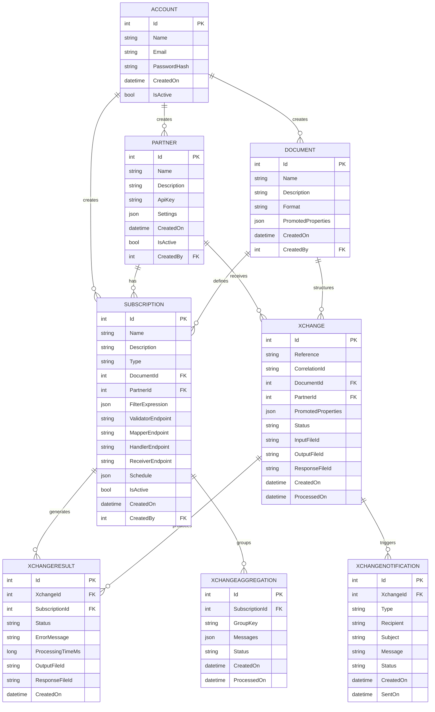

# Domain Model

This document describes the core domain entities and their relationships in the Bitween integration middleware.

## Entity Relationship Overview



## Core Entities

### Account

Represents a user account in the system with authentication and authorization capabilities.

```csharp
public class Account
{
    public int Id { get; set; }
    public string Name { get; set; }
    public string Email { get; set; }
    public string PasswordHash { get; set; }
    public DateTime CreatedOn { get; set; }
    public bool IsActive { get; set; }
    
    // Navigation properties
    public ICollection<Partner> Partners { get; set; }
    public ICollection<Document> Documents { get; set; }
    public ICollection<Subscription> Subscriptions { get; set; }
}
```

**Purpose:**
- User authentication and authorization
- Ownership and access control for resources
- Audit trail for user actions

**Key Properties:**
- `Email`: Unique identifier for authentication
- `PasswordHash`: Securely stored password
- `IsActive`: Enables/disables account access

### Partner

Represents an external system or organization that integrates with Bitween.

```csharp
public class Partner
{
    public int Id { get; set; }
    public string Name { get; set; }
    public string Description { get; set; }
    public string ApiKey { get; set; }
    public JsonDocument Settings { get; set; }
    public DateTime CreatedOn { get; set; }
    public bool IsActive { get; set; }
    public int CreatedBy { get; set; }
    
    // Navigation properties
    public Account Creator { get; set; }
    public ICollection<Subscription> Subscriptions { get; set; }
    public ICollection<Xchange> Xchanges { get; set; }
}
```

**Purpose:**
- Multi-tenant isolation and security
- External system identification
- API access control and configuration

**Key Properties:**
- `ApiKey`: Unique identifier for API authentication
- `Settings`: Partner-specific configuration (JSON)
- `IsActive`: Controls partner access to the system

**Settings Examples:**
```json
{
  "endpoints": {
    "webhook": "https://partner.com/webhooks/bitween",
    "api": "https://partner.com/api/v1"
  },
  "authentication": {
    "type": "Bearer",
    "token": "partner-api-token"
  },
  "limits": {
    "maxRequestsPerHour": 1000,
    "maxFileSize": "10MB"
  },
  "notifications": {
    "email": "admin@partner.com",
    "onError": true,
    "onSuccess": false
  }
}
```

### Document

Defines a message type with its structure, format, and promoted properties for filtering and routing.

```csharp
public class Document
{
    public int Id { get; set; }
    public string Name { get; set; }
    public string Description { get; set; }
    public string Format { get; set; }
    public JsonDocument PromotedProperties { get; set; }
    public DateTime CreatedOn { get; set; }
    public int CreatedBy { get; set; }
    
    // Navigation properties
    public Account Creator { get; set; }
    public ICollection<Subscription> Subscriptions { get; set; }
    public ICollection<Xchange> Xchanges { get; set; }
}
```

**Purpose:**
- Message type definition and schema
- Property extraction for filtering and routing
- Data validation and structure enforcement

**Key Properties:**
- `Format`: Message format (JSON, XML, EDI, etc.)
- `PromotedProperties`: JSONPath expressions for property extraction

**Promoted Properties Examples:**

For JSON messages:
```json
{
  "customerId": "$.customer.id",
  "orderTotal": "$.order.total",
  "orderDate": "$.order.date",
  "orderType": "$.order.type",
  "priority": "$.metadata.priority"
}
```

For XML messages:
```json
{
  "invoiceNumber": "//Invoice/@Number",
  "invoiceAmount": "//Invoice/Amount/text()",
  "vendorId": "//Vendor/@Id",
  "dueDate": "//Invoice/DueDate/text()"
}
```

### Subscription

Defines processing rules and routing logic for how messages should be handled.

```csharp
public class Subscription
{
    public int Id { get; set; }
    public string Name { get; set; }
    public string Description { get; set; }
    public SubscriptionType Type { get; set; }
    public int DocumentId { get; set; }
    public int PartnerId { get; set; }
    public JsonDocument FilterExpression { get; set; }
    public string ValidatorEndpoint { get; set; }
    public string MapperEndpoint { get; set; }
    public string HandlerEndpoint { get; set; }
    public string ReceiverEndpoint { get; set; }
    public JsonDocument Schedule { get; set; }
    public bool IsActive { get; set; }
    public DateTime CreatedOn { get; set; }
    public int CreatedBy { get; set; }
    
    // Navigation properties
    public Document Document { get; set; }
    public Partner Partner { get; set; }
    public Account Creator { get; set; }
    public ICollection<XchangeResult> XchangeResults { get; set; }
    public ICollection<XchangeAggregation> Aggregations { get; set; }
}

public enum SubscriptionType
{
    ApiCall,     // Synchronous processing
    Internal,    // Asynchronous processing
    Receiving,   // Scheduled data retrieval
    Aggregation  // Batch processing
}
```

**Purpose:**
- Message routing and filtering logic
- Processing pipeline configuration
- Serverless adapter endpoint management

**Key Properties:**
- `Type`: Processing pattern (synchronous, asynchronous, scheduled, batch)
- `FilterExpression`: Conditions for message matching
- `*Endpoint`: URLs for custom adapters

**Filter Expression Examples:**

Simple equality:
```json
{
  "customerId": { "operator": "equals", "value": "PREMIUM_CUSTOMER" }
}
```

Complex conditions:
```json
{
  "orderTotal": { "operator": "greaterThan", "value": 1000 },
  "customerType": { "operator": "in", "value": ["premium", "enterprise"] },
  "region": { "operator": "notEquals", "value": "restricted" }
}
```

**Schedule Examples:**

Recurring schedule:
```json
{
  "type": "Recurring",
  "intervalMinutes": 60,
  "startTime": "08:00",
  "endTime": "18:00",
  "timeZone": "UTC"
}
```

Cron-based schedule:
```json
{
  "type": "Cron",
  "expression": "0 */15 * * *",
  "timeZone": "America/New_York"
}
```

### Xchange

Represents an individual message processing transaction.

```csharp
public class Xchange
{
    public int Id { get; set; }
    public string Reference { get; set; }
    public string CorrelationId { get; set; }
    public int DocumentId { get; set; }
    public int? PartnerId { get; set; }
    public JsonDocument PromotedProperties { get; set; }
    public XchangeStatus Status { get; set; }
    public string InputFileId { get; set; }
    public string OutputFileId { get; set; }
    public string ResponseFileId { get; set; }
    public DateTime CreatedOn { get; set; }
    public DateTime? ProcessedOn { get; set; }
    
    // Navigation properties
    public Document Document { get; set; }
    public Partner Partner { get; set; }
    public ICollection<XchangeResult> Results { get; set; }
    public ICollection<XchangeNotification> Notifications { get; set; }
}

public enum XchangeStatus
{
    Received,     // Initial state
    Processing,   // Currently being processed
    Processed,    // Successfully completed
    Failed,       // Processing failed
    Cancelled     // Processing cancelled
}
```

**Purpose:**
- Individual message transaction tracking
- Processing state management
- File artifact management

**Key Properties:**
- `Reference`: Business identifier (order number, invoice ID, etc.)
- `CorrelationId`: Groups related messages together
- `PromotedProperties`: Extracted values for filtering/searching
- `*FileId`: References to stored file artifacts

**File Lifecycle:**
1. `InputFileId`: Original message content
2. `OutputFileId`: Processed/transformed content
3. `ResponseFileId`: Response sent back to originator

### XchangeResult

Tracks the processing outcome for each subscription that processes a message.

```csharp
public class XchangeResult
{
    public int Id { get; set; }
    public int XchangeId { get; set; }
    public int SubscriptionId { get; set; }
    public XchangeResultStatus Status { get; set; }
    public string ErrorMessage { get; set; }
    public long ProcessingTimeMs { get; set; }
    public string OutputFileId { get; set; }
    public string ResponseFileId { get; set; }
    public DateTime CreatedOn { get; set; }
    
    // Navigation properties
    public Xchange Xchange { get; set; }
    public Subscription Subscription { get; set; }
}

public enum XchangeResultStatus
{
    Success,
    ValidationError,
    MappingError,
    ProcessingError,
    TimeoutError,
    RetryExhausted
}
```

**Purpose:**
- Per-subscription processing tracking
- Error analysis and debugging
- Performance monitoring

**Key Properties:**
- `Status`: Processing outcome
- `ErrorMessage`: Detailed error information
- `ProcessingTimeMs`: Performance metrics

### XchangeNotification

Manages notifications sent based on processing outcomes.

```csharp
public class XchangeNotification
{
    public int Id { get; set; }
    public int XchangeId { get; set; }
    public NotificationType Type { get; set; }
    public string Recipient { get; set; }
    public string Subject { get; set; }
    public string Message { get; set; }
    public NotificationStatus Status { get; set; }
    public DateTime CreatedOn { get; set; }
    public DateTime? SentOn { get; set; }
    
    // Navigation properties
    public Xchange Xchange { get; set; }
}

public enum NotificationType
{
    Email,
    SMS,
    Webhook,
    PushNotification
}

public enum NotificationStatus
{
    Pending,
    Sent,
    Failed,
    Cancelled
}
```

**Purpose:**
- Event-driven communication
- Processing status updates
- Error alerting

### XchangeAggregation

Manages batch processing and message aggregation.

```csharp
public class XchangeAggregation
{
    public int Id { get; set; }
    public int SubscriptionId { get; set; }
    public string GroupKey { get; set; }
    public JsonDocument Messages { get; set; }
    public AggregationStatus Status { get; set; }
    public DateTime CreatedOn { get; set; }
    public DateTime? ProcessedOn { get; set; }
    
    // Navigation properties
    public Subscription Subscription { get; set; }
}

public enum AggregationStatus
{
    Collecting,
    ReadyForProcessing,
    Processing,
    Processed,
    Failed
}
```

**Purpose:**
- Batch processing coordination
- Message grouping and accumulation
- Scheduled bulk operations

**Key Properties:**
- `GroupKey`: Logical grouping identifier
- `Messages`: Accumulated message collection
- `Status`: Aggregation lifecycle state

## Domain Services

### XchangeService

Orchestrates message processing workflow:

```csharp
public interface IXchangeService
{
    Task<Xchange> CreateXchange(CreateXchangeRequest request);
    Task<Xchange> GetXchange(int id);
    Task<PagedResult<Xchange>> SearchXchanges(XchangeSearchCriteria criteria);
    Task<IEnumerable<XchangeResult>> GetXchangeResults(int xchangeId);
    Task ReprocessXchange(int xchangeId);
}
```

### FilterService

Handles message filtering and subscription matching:

```csharp
public interface IFilterService
{
    Task<IEnumerable<Subscription>> GetMatchingSubscriptions(Xchange xchange);
    bool EvaluateFilterExpression(JsonDocument expression, JsonDocument promotedProperties);
}
```

### NotificationService

Manages notification delivery:

```csharp
public interface INotificationService
{
    Task SendNotification(XchangeNotification notification);
    Task<NotificationStatus> GetNotificationStatus(int notificationId);
}
```

## Value Objects

### PropertyMatchSpecification

Represents filtering criteria for promoted properties:

```csharp
public class PropertyMatchSpecification
{
    public string Property { get; set; }
    public MatchOperator Operator { get; set; }
    public object Value { get; set; }
    public LogicalOperator LogicalOperator { get; set; }
}

public enum MatchOperator
{
    Equals,
    NotEquals,
    GreaterThan,
    LessThan,
    GreaterThanOrEqual,
    LessThanOrEqual,
    Contains,
    StartsWith,
    EndsWith,
    In,
    NotIn,
    Exists,
    NotExists
}

public enum LogicalOperator
{
    And,
    Or
}
```

### Schedule

Represents scheduling configuration:

```csharp
public class Schedule
{
    public ScheduleType Type { get; set; }
    public int? IntervalMinutes { get; set; }
    public string CronExpression { get; set; }
    public TimeSpan? StartTime { get; set; }
    public TimeSpan? EndTime { get; set; }
    public string TimeZone { get; set; }
}

public enum ScheduleType
{
    OneTime,
    Recurring,
    Cron,
    Manual
}
```

## Domain Events

Domain events enable loose coupling and async processing:

### XchangeCreated

```csharp
public class XchangeCreatedEvent : IDomainEvent
{
    public int XchangeId { get; set; }
    public DateTime OccurredOn { get; set; }
}
```

### XchangeProcessed

```csharp
public class XchangeProcessedEvent : IDomainEvent
{
    public int XchangeId { get; set; }
    public XchangeStatus Status { get; set; }
    public DateTime OccurredOn { get; set; }
}
```

### NotificationRequired

```csharp
public class NotificationRequiredEvent : IDomainEvent
{
    public int XchangeId { get; set; }
    public NotificationType Type { get; set; }
    public string Recipient { get; set; }
    public DateTime OccurredOn { get; set; }
}
```

## Repository Patterns

### IXchangeRepository

```csharp
public interface IXchangeRepository
{
    Task<Xchange> GetById(int id);
    Task<Xchange> GetByReference(string reference);
    Task<PagedResult<Xchange>> Search(XchangeSearchCriteria criteria);
    Task<Xchange> Create(Xchange xchange);
    Task Update(Xchange xchange);
    Task Delete(int id);
}
```

### ISubscriptionRepository

```csharp
public interface ISubscriptionRepository
{
    Task<IEnumerable<Subscription>> GetByDocument(int documentId);
    Task<IEnumerable<Subscription>> GetByPartner(int partnerId);
    Task<IEnumerable<Subscription>> GetActive();
    Task<Subscription> Create(Subscription subscription);
    Task Update(Subscription subscription);
}
```

This domain model provides a comprehensive foundation for understanding the data structures and relationships within the Bitween integration middleware, enabling effective message processing, routing, and management.
