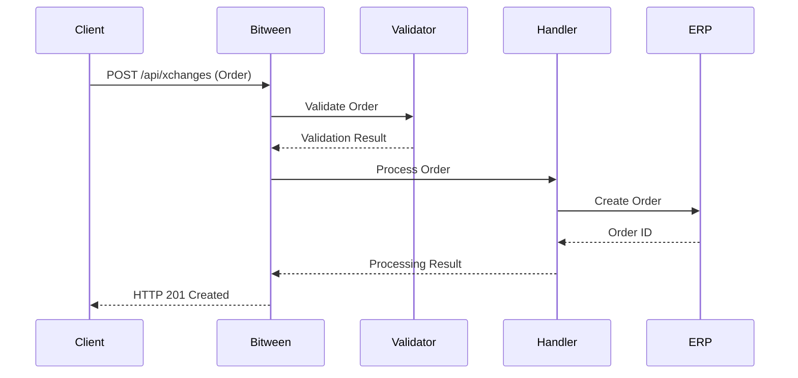
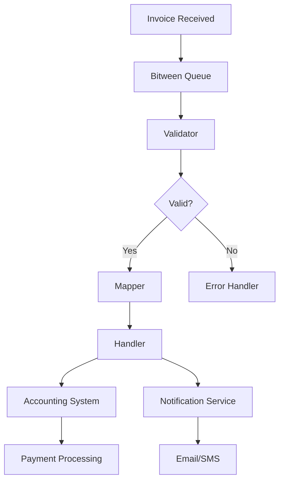
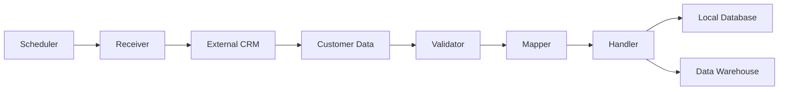
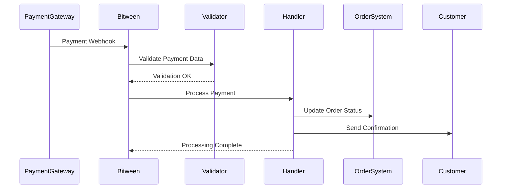
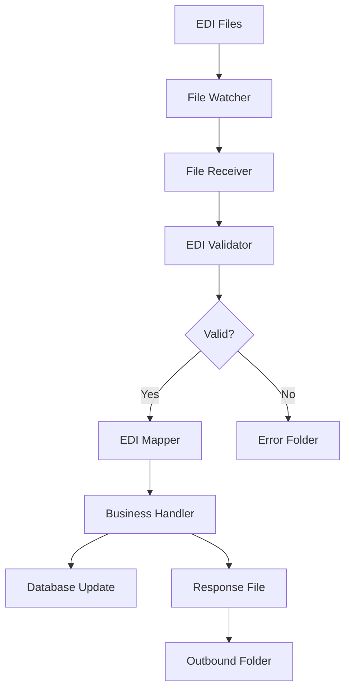
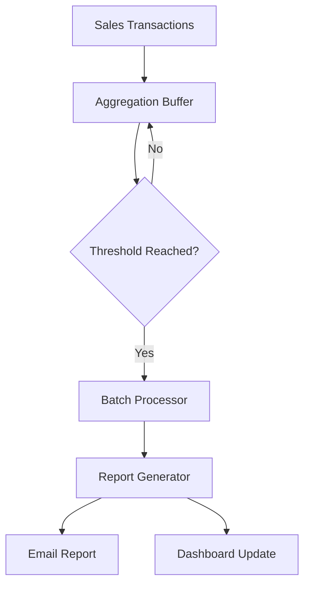
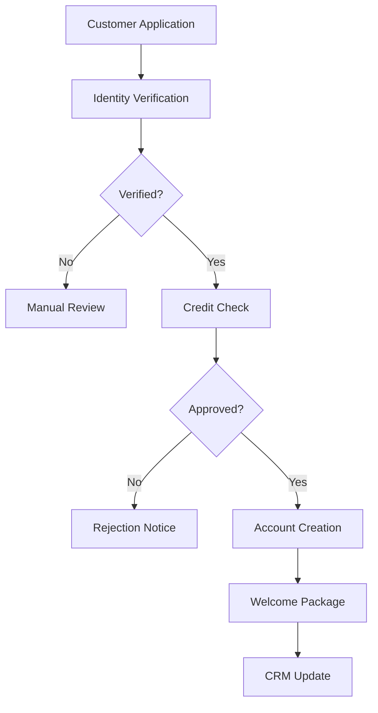

# Integration Patterns

This guide covers common integration patterns and use cases for Bitween, providing practical examples and best practices for different scenarios.

## Overview

Bitween supports multiple integration patterns to handle various data exchange scenarios. Each pattern is designed for specific use cases and offers different benefits in terms of performance, reliability, and complexity.

## 1. Synchronous API Integration

### Use Case
Real-time data exchange where immediate response is required.

### Pattern Description
- Message sent via API call
- Immediate processing and response
- Perfect for user-facing operations

### Example: Order Processing



#### Configuration

**Document Definition:**
```json
{
  "name": "CustomerOrder",
  "format": "JSON",
  "promotedProperties": {
    "customerId": "$.customer.id",
    "orderTotal": "$.order.total",
    "priority": "$.order.priority"
  }
}
```

**Subscription Setup:**
```json
{
  "name": "Real-time Order Processing",
  "type": "ApiCall",
  "documentId": 1,
  "partnerId": 1,
  "validatorEndpoint": "https://validators.company.com/order-validator",
  "handlerEndpoint": "https://handlers.company.com/order-processor",
  "filterExpression": {
    "priority": { "operator": "equals", "value": "high" }
  }
}
```

#### Client Implementation

```csharp
public async Task<OrderResponse> SubmitOrder(Order order)
{
    var xchangeRequest = new
    {
        documentId = 1,
        reference = order.OrderNumber,
        data = order
    };

    var response = await httpClient.PostAsJsonAsync(
        "https://bitween.company.com/api/xchanges", 
        xchangeRequest);

    response.EnsureSuccessStatusCode();
    return await response.Content.ReadFromJsonAsync<OrderResponse>();
}
```

## 2. Asynchronous Message Processing

### Use Case
High-volume message processing where immediate response is not required.

### Pattern Description
- Messages queued for processing
- Background processing with event handling
- Ideal for batch operations and workflows

### Example: Invoice Processing



#### Configuration

**Subscription Setup:**
```json
{
  "name": "Invoice Processing Workflow",
  "type": "Internal",
  "documentId": 2,
  "partnerId": 1,
  "validatorEndpoint": "https://validators.company.com/invoice-validator",
  "mapperEndpoint": "https://mappers.company.com/invoice-mapper",
  "handlerEndpoint": "https://handlers.company.com/invoice-processor",
  "filterExpression": {
    "amount": { "operator": "greaterThan", "value": 1000 }
  }
}
```

#### Message Submission

```csharp
public async Task SubmitInvoiceAsync(Invoice invoice)
{
    var xchangeRequest = new
    {
        documentId = 2,
        reference = invoice.InvoiceNumber,
        correlationId = invoice.BatchId,
        data = invoice
    };

    await httpClient.PostAsJsonAsync(
        "https://bitween.company.com/api/xchanges", 
        xchangeRequest);
    
    // No immediate response needed
    // Processing will continue asynchronously
}
```

## 3. Scheduled Data Synchronization

### Use Case
Regular data synchronization between systems on a schedule.

### Pattern Description
- Automated data retrieval from external sources
- Scheduled execution using receivers
- Perfect for nightly imports and exports

### Example: Customer Data Sync



#### Receiver Implementation

```csharp
public class CustomerSyncReceiver : IInfolinkReceiver
{
    private readonly HttpClient _httpClient;
    private readonly ILogger<CustomerSyncReceiver> _logger;

    public CustomerSyncReceiver(HttpClient httpClient, ILogger<CustomerSyncReceiver> logger)
    {
        _httpClient = httpClient;
        _logger = logger;
    }

    public async Task<IEnumerable<XchangeFile>> Receive()
    {
        try
        {
            // Get customers modified since last sync
            var lastSync = await GetLastSyncTime();
            var customers = await GetModifiedCustomers(lastSync);

            var xchangeFiles = new List<XchangeFile>();

            foreach (var customer in customers)
            {
                xchangeFiles.Add(new XchangeFile
                {
                    Data = JsonSerializer.Serialize(customer),
                    ContentType = "application/json",
                    Reference = customer.CustomerId,
                    FileName = $"customer-{customer.CustomerId}-{DateTime.UtcNow:yyyyMMddHHmmss}.json"
                });
            }

            await UpdateLastSyncTime(DateTime.UtcNow);
            _logger.LogInformation($"Retrieved {xchangeFiles.Count} customer records");

            return xchangeFiles;
        }
        catch (Exception ex)
        {
            _logger.LogError(ex, "Failed to retrieve customer data");
            throw;
        }
    }

    private async Task<DateTime> GetLastSyncTime()
    {
        // Implementation to get last sync timestamp
        return DateTime.UtcNow.AddHours(-24); // Default to last 24 hours
    }

    private async Task<IEnumerable<Customer>> GetModifiedCustomers(DateTime since)
    {
        var response = await _httpClient.GetAsync(
            $"https://crm.company.com/api/customers?modifiedSince={since:yyyy-MM-ddTHH:mm:ssZ}");
        
        response.EnsureSuccessStatusCode();
        return await response.Content.ReadFromJsonAsync<IEnumerable<Customer>>();
    }
}
```

#### Subscription Configuration

```json
{
  "name": "Customer Data Synchronization",
  "type": "Receiving",
  "documentId": 3,
  "partnerId": 1,
  "receiverEndpoint": "https://receivers.company.com/customer-sync",
  "handlerEndpoint": "https://handlers.company.com/customer-processor",
  "schedule": {
    "type": "Recurring",
    "cronExpression": "0 2 * * *",
    "timeZone": "UTC"
  }
}
```

## 4. Event-Driven Integration

### Use Case
React to events from external systems via webhooks or message queues.

### Pattern Description
- External systems send events to Bitween
- Events trigger processing workflows
- Ideal for real-time notifications and updates

### Example: Payment Processing



#### Webhook Handler

```csharp
[ApiController]
[Route("api/webhooks")]
public class WebhookController : ControllerBase
{
    private readonly IXchangeService _xchangeService;

    public WebhookController(IXchangeService xchangeService)
    {
        _xchangeService = xchangeService;
    }

    [HttpPost("payment")]
    public async Task<IActionResult> HandlePaymentWebhook([FromBody] PaymentWebhook webhook)
    {
        try
        {
            // Verify webhook signature
            if (!IsValidSignature(webhook))
            {
                return Unauthorized();
            }

            // Create exchange for processing
            var xchange = new CreateXchangeRequest
            {
                DocumentId = 4, // Payment document type
                Reference = webhook.PaymentId,
                CorrelationId = webhook.OrderId,
                Data = webhook
            };

            await _xchangeService.CreateXchange(xchange);
            return Ok();
        }
        catch (Exception ex)
        {
            _logger.LogError(ex, "Failed to process payment webhook");
            return StatusCode(500);
        }
    }
}
```

## 5. File-Based Integration

### Use Case
Process files dropped in specific locations or transferred via SFTP/FTP.

### Pattern Description
- Monitor file locations for new files
- Process files and move to processed/error folders
- Support for various file formats

### Example: EDI Processing



#### File Receiver Implementation

```csharp
public class EdiFileReceiver : IInfolinkReceiver
{
    private readonly string _inputPath;
    private readonly string _processedPath;
    private readonly string _errorPath;

    public EdiFileReceiver()
    {
        _inputPath = Environment.GetEnvironmentVariable("EDI_INPUT_PATH") ?? "./edi/input";
        _processedPath = Environment.GetEnvironmentVariable("EDI_PROCESSED_PATH") ?? "./edi/processed";
        _errorPath = Environment.GetEnvironmentVariable("EDI_ERROR_PATH") ?? "./edi/error";
        
        EnsureDirectoriesExist();
    }

    public async Task<IEnumerable<XchangeFile>> Receive()
    {
        var files = new List<XchangeFile>();
        var ediFiles = Directory.GetFiles(_inputPath, "*.edi")
            .Where(f => File.GetCreationTime(f) < DateTime.Now.AddMinutes(-2)) // Wait for complete upload
            .OrderBy(f => File.GetCreationTime(f));

        foreach (var filePath in ediFiles)
        {
            try
            {
                var content = await File.ReadAllTextAsync(filePath);
                var fileName = Path.GetFileName(filePath);
                
                files.Add(new XchangeFile
                {
                    Data = content,
                    ContentType = "application/edi-x12",
                    FileName = fileName,
                    Reference = Path.GetFileNameWithoutExtension(fileName)
                });

                // Move to processed folder
                var processedFile = Path.Combine(_processedPath, $"{DateTime.UtcNow:yyyyMMddHHmmss}_{fileName}");
                File.Move(filePath, processedFile);
            }
            catch (Exception ex)
            {
                // Move to error folder
                var errorFile = Path.Combine(_errorPath, $"{DateTime.UtcNow:yyyyMMddHHmmss}_ERROR_{Path.GetFileName(filePath)}");
                File.Move(filePath, errorFile);
                
                // Log error
                Console.WriteLine($"Error processing file {filePath}: {ex.Message}");
            }
        }

        return files;
    }
}
```

## 6. Aggregation and Batch Processing

### Use Case
Collect multiple messages and process them as a batch.

### Pattern Description
- Accumulate messages over time
- Process when threshold or time limit reached
- Ideal for bulk operations and reporting

### Example: Daily Sales Report



#### Aggregation Configuration

```json
{
  "name": "Daily Sales Aggregation",
  "type": "Aggregation",
  "documentId": 5,
  "partnerId": 1,
  "handlerEndpoint": "https://handlers.company.com/sales-report-generator",
  "aggregationSettings": {
    "maxMessages": 1000,
    "maxWaitTimeMinutes": 1440,
    "groupBy": ["storeId", "date"]
  },
  "schedule": {
    "type": "Daily",
    "hour": 23,
    "minute": 59
  }
}
```

#### Batch Handler

```csharp
public class SalesReportHandler : IInfolinkHandler
{
    public async Task<XchangeFile> Handle(XchangeFile input)
    {
        // Input contains aggregated sales data
        var aggregatedData = JsonSerializer.Deserialize<AggregatedSalesData>(input.Data.ToString());
        
        // Generate report
        var report = await GenerateSalesReport(aggregatedData);
        
        // Send email
        await SendReportEmail(report);
        
        // Update dashboard
        await UpdateDashboard(report);
        
        return new XchangeFile
        {
            Data = JsonSerializer.Serialize(report),
            ContentType = "application/json",
            FileName = $"sales-report-{DateTime.UtcNow:yyyy-MM-dd}.json"
        };
    }

    private async Task<SalesReport> GenerateSalesReport(AggregatedSalesData data)
    {
        return new SalesReport
        {
            Date = DateTime.UtcNow.Date,
            TotalSales = data.Transactions.Sum(t => t.Amount),
            TransactionCount = data.Transactions.Count,
            StoreBreakdown = data.Transactions
                .GroupBy(t => t.StoreId)
                .Select(g => new StoreReport
                {
                    StoreId = g.Key,
                    Sales = g.Sum(t => t.Amount),
                    TransactionCount = g.Count()
                })
                .ToList()
        };
    }
}
```

## 7. Multi-Step Workflow

### Use Case
Complex processing requiring multiple sequential steps.

### Pattern Description
- Chain multiple processors together
- Each step can transform or enrich data
- Support for conditional logic and branching

### Example: Customer Onboarding



#### Multi-Step Configuration

```json
{
  "name": "Customer Onboarding - Step 1",
  "type": "Internal",
  "documentId": 6,
  "partnerId": 1,
  "validatorEndpoint": "https://validators.company.com/identity-validator",
  "handlerEndpoint": "https://handlers.company.com/identity-processor",
  "nextStep": {
    "successSubscriptionId": 2,
    "failureSubscriptionId": 3
  }
}
```

#### Workflow Handler

```csharp
public class IdentityVerificationHandler : IInfolinkHandler
{
    private readonly IIdentityService _identityService;
    private readonly IXchangeService _xchangeService;

    public async Task<XchangeFile> Handle(XchangeFile input)
    {
        var application = JsonSerializer.Deserialize<CustomerApplication>(input.Data.ToString());
        
        // Perform identity verification
        var verificationResult = await _identityService.VerifyIdentity(application);
        
        if (verificationResult.Success)
        {
            // Continue to credit check
            await _xchangeService.CreateXchange(new CreateXchangeRequest
            {
                DocumentId = 7, // Credit check document
                Reference = application.ApplicationId,
                CorrelationId = application.CorrelationId,
                Data = new
                {
                    Application = application,
                    IdentityVerification = verificationResult
                }
            });
        }
        else
        {
            // Send for manual review
            await _xchangeService.CreateXchange(new CreateXchangeRequest
            {
                DocumentId = 8, // Manual review document
                Reference = application.ApplicationId,
                CorrelationId = application.CorrelationId,
                Data = new
                {
                    Application = application,
                    VerificationFailure = verificationResult
                }
            });
        }

        return new XchangeFile
        {
            Data = JsonSerializer.Serialize(verificationResult),
            ContentType = "application/json"
        };
    }
}
```

## Best Practices

### 1. Error Handling

```csharp
public async Task<XchangeFile> Handle(XchangeFile input)
{
    try
    {
        // Processing logic
        return await ProcessMessage(input);
    }
    catch (ValidationException ex)
    {
        // Business validation errors - don't retry
        throw new ProcessingException("Validation failed", ex) { IsRetryable = false };
    }
    catch (HttpRequestException ex)
    {
        // External service errors - may be retryable
        throw new ProcessingException("External service error", ex) { IsRetryable = true };
    }
    catch (Exception ex)
    {
        // Unexpected errors - investigate before retry
        _logger.LogError(ex, "Unexpected error processing message");
        throw;
    }
}
```

### 2. Idempotency

```csharp
public async Task<XchangeFile> Handle(XchangeFile input)
{
    var reference = input.Reference;
    
    // Check if already processed
    var existingResult = await _repository.GetProcessingResult(reference);
    if (existingResult != null)
    {
        _logger.LogInformation($"Message {reference} already processed, returning cached result");
        return existingResult;
    }
    
    // Process message
    var result = await ProcessMessage(input);
    
    // Cache result for future idempotency checks
    await _repository.SaveProcessingResult(reference, result);
    
    return result;
}
```

### 3. Monitoring and Observability

```csharp
public async Task<XchangeFile> Handle(XchangeFile input)
{
    using var activity = _activitySource.StartActivity("process-order");
    activity?.SetTag("order.id", input.Reference);
    
    var stopwatch = Stopwatch.StartNew();
    
    try
    {
        _logger.LogInformation("Processing order {OrderId}", input.Reference);
        
        var result = await ProcessOrder(input);
        
        _metrics.RecordProcessingTime(stopwatch.ElapsedMilliseconds);
        _metrics.IncrementCounter("orders.processed.success");
        
        _logger.LogInformation("Successfully processed order {OrderId} in {Duration}ms", 
            input.Reference, stopwatch.ElapsedMilliseconds);
        
        return result;
    }
    catch (Exception ex)
    {
        _metrics.IncrementCounter("orders.processed.error");
        _logger.LogError(ex, "Failed to process order {OrderId}", input.Reference);
        throw;
    }
}
```

### 4. Configuration Management

```json
{
  "subscriptions": [
    {
      "name": "High Priority Orders",
      "filterExpression": {
        "priority": { "operator": "equals", "value": "high" }
      },
      "handlerEndpoint": "https://handlers.company.com/priority-order-processor",
      "timeoutSeconds": 30,
      "retryAttempts": 3
    },
    {
      "name": "Standard Orders",
      "filterExpression": {
        "priority": { "operator": "notEquals", "value": "high" }
      },
      "handlerEndpoint": "https://handlers.company.com/standard-order-processor",
      "timeoutSeconds": 120,
      "retryAttempts": 5
    }
  ]
}
```

This comprehensive guide covers the most common integration patterns with Bitween, providing practical examples and best practices for each scenario.
